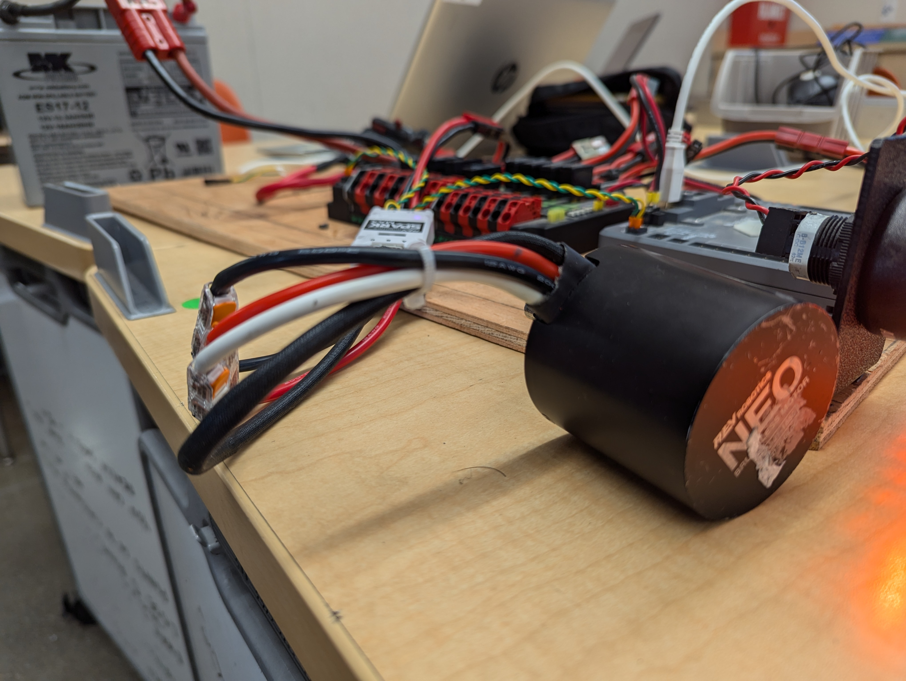
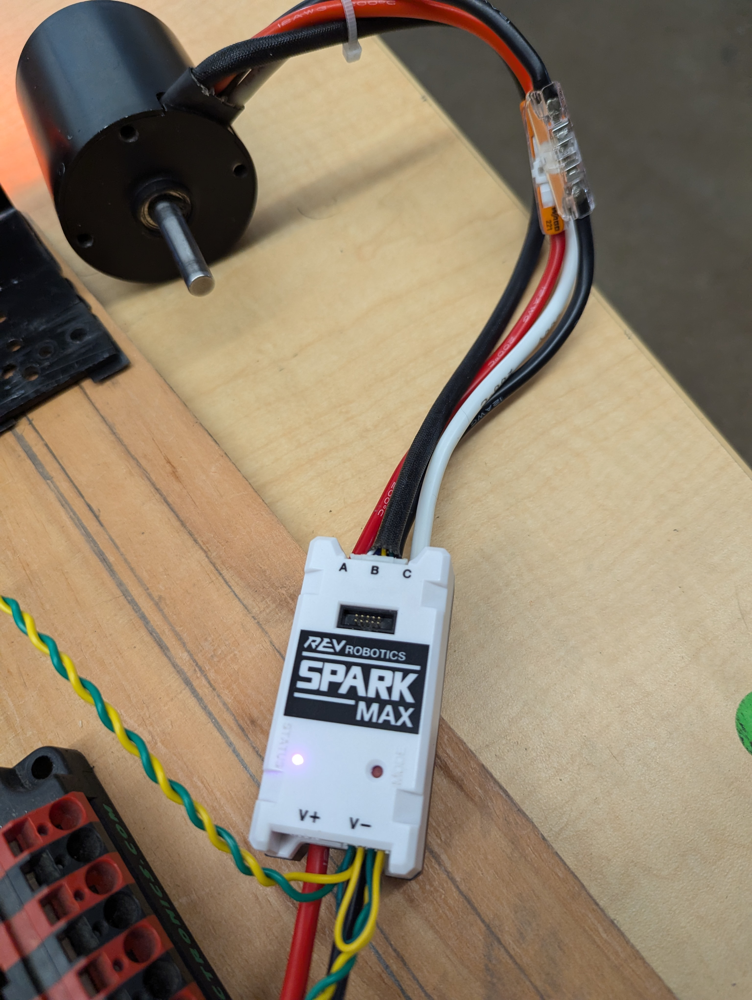
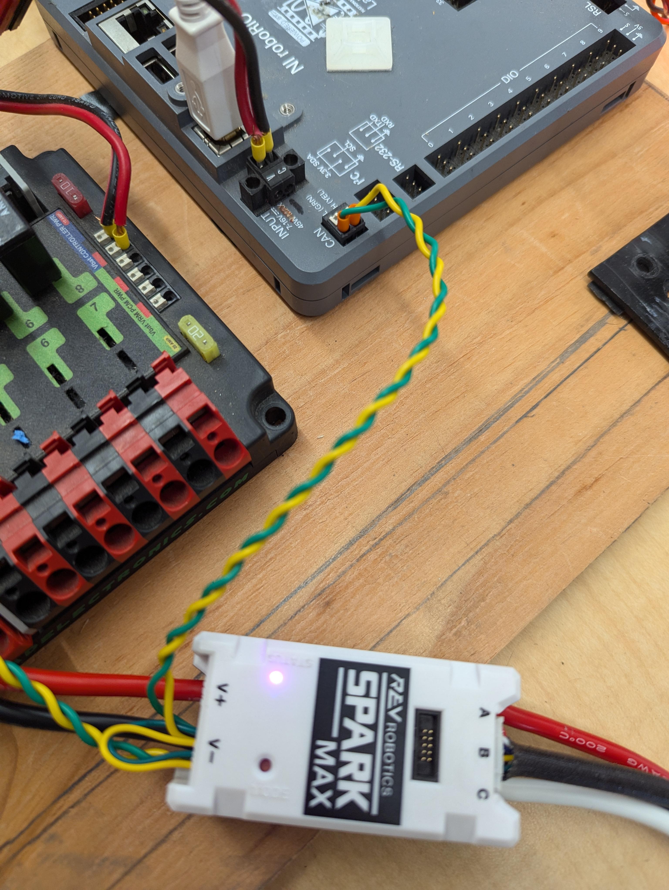
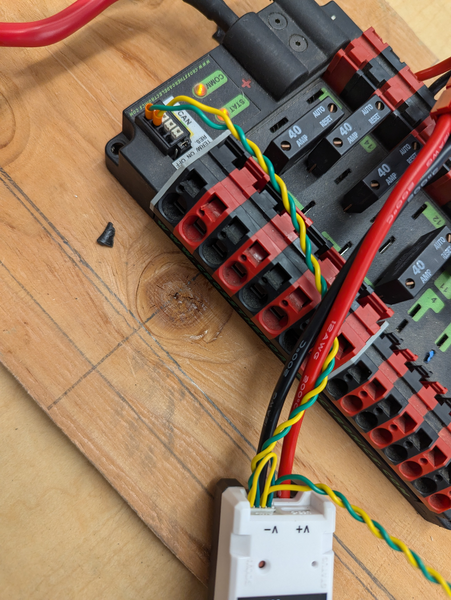
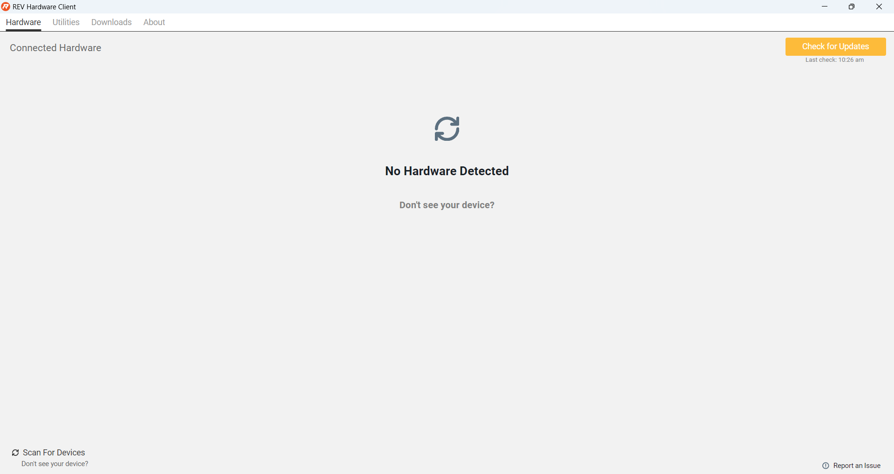
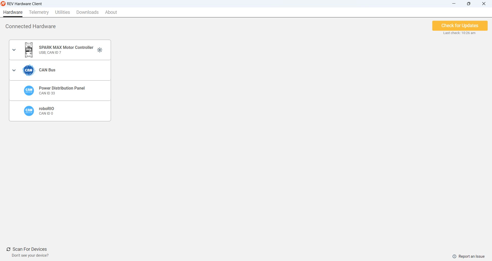
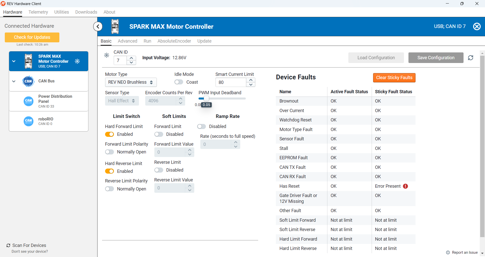

# Controlling Your First Motor
This guide assumes you have set up your development environment, have a test RoboRIO board set up, and are ready to try to control your first motor.

## Connect the Motor
1. Get a mentor to give you a Neo motor and associated wiring.
    1. 
1. Connect the Neo motor power to the Spark Max motor controller.
    1. 
1. Connect the Spark Max to power and the CAN bus. Make sure the yellow/green wires go into the right slots (they are labeled). Don't worry which one goes into the Rio and which ones goes into the other black thing (don't know the name).
    1. 
    1. 
1. The Spark Max light should be flashing if you got this right.

## Get the CAN ID of your Motor
You should be using a Spark Max controller per the picture above. It has a USB-C port and you need to run the Spark binary to connect to it and get the CAN ID out of it. Details of how this works are available [here](https://docs.revrobotics.com/brushless/spark-max/control-interfaces#can-interface) and detailed instructions are [here](https://docs.revrobotics.com/rev-hardware-client/ion/spark-max); below is a quick start version.

1. Download the Rev Hardware Client from [here](https://docs.revrobotics.com/rev-hardware-client) if you don't have it already. It's installed on many devices so look for it before doing this step.
1. Start the REV Hardware Client (Windows + "Rev").
    1. You should see a window like this: 
1. Plug the USB-C cable into your computer and the controller. Hit "refresh" on the REV Hardware Client window.
    1. You should see a window like this: 
1. Let's make sure your CAN bus has been set up OK. Click on the `CAN Bus` tab (you should see "Bus OK") and then the `CAN Data` tab. You can watch the CAN bus messages flowing here.
    1. 
1. Let's make sure your motor works. Click on the `SPARK MAX Motor Controller` tab and make sure the voltage is around 12V:
    1. 
1. Make sure you record the CAN ID in the top left corner of this page (7 in the picture above). Yours might be different. 
    1. You can also change it from this page, if you run into a situation where multiple motors have the same CAN ID later. REMEMBER: every CAN device needs to have a unique ID!
1. Click on the `Run` tab, make sure `Mode=Percent`, and set it to 0.01 (1%). Then click `Run Motor`.
    1. 
1. Your motor should be running very slowly!

## DONE!
You are done with this chapter. Move to the next one!