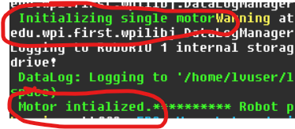

# Controlling the Motor from the RoboRIO
We finally have the pieces in place to write our first real Control code! Let's open up your Study if you haven't yet, and find the `Robot.java` class. We are going to have to put the motor control code into this class. For now, we will keep it simple and just edit this file directly.

## Initializing the Motor
Team100 has code to control various types of motors in the `lib/motor` directory. We are going to use the `NeoCANSparkMotor` which looks like this:

```java
public class NeoCANSparkMotor extends CANSparkMotor {
    /**
     * Note the PID values should be in duty cycle per RPM, i.e. very small. {@link
     * Rev100}
     */
    public NeoCANSparkMotor(
            LoggerFactory parent,
            int canId,
            MotorPhase motorPhase,
            int currentLimit,
            Feedforward100 ff,
            PIDConstants pid) {
        super(parent, new CANSparkMax(canId, MotorType.kBrushless),
                motorPhase, currentLimit, ff, pid);
    }
```

So to use this we need a few things:
1. `LoggerFactory parent`: Loggers are used to print information about what our code is doing. We won't be using this yet, but we do need to set it so the code doesn't crash. Use the following value and don't worry about why it works: 
    1. `Logging.instance().rootLogger.child("test logger")`
1. `int canId`: you should have saved this from a previous README step.
1. `MotorPhase motorPhase`: set it to `MotorPhase.FORWARD`
1. `int currentLimit`: set it to `30`
1. `FeedForward100 ff`: The `Feedforwward` class has a helper method, so let's use that: `Feedforward100.makeNeo()`
1. `PIDConstants pid`: this is for more advanced use of the motor (with a controller running a feedback loop). We will ignore it for now, so just set it to 0: `new PIDConstants(0, 0, 0)`

In the end you will have the following code:

```java

  // This goes as a class member variable:
  private BareMotor m_single_motor;

  // ... a little later you will have

  @Override
  public void robotInit() {
    Util.printf("Initializing single motor");
    m_single_motor = new NeoCANSparkMotor(
      Logging.instance().rootLogger.child("test logger"),
      7,  // THIS SHOULD BE YOUR CAN ID, not 7!!
      MotorPhase.FORWARD, 
      30, 
      Feedforward100.makeNeo(), 
      new PIDConstants(0, 0, 0));
    Util.printf("Motor intialized.");
  }
```

Go ahead and Build + Deploy your code to make sure you see the print statements on your RoboRIO Driver Station console. If you don't... fix it before you continue. They might be hidden between other messages so look carefully; we'll worry about this later:


## Turning the Motor
The RoboRIO will call `public void robotPeriodic()` every cycle (50Hz) in every mode (autonomous, teleop, etc) so it's a good place to try to turn our motor. 

Let's start the simple way. `BaseMotor` has a `setDutyCycle` function that lets us turn the motor between `[-1, 1]`. -1 is max speed in reverse, and 1 is max speed forward. Let's set it to something reasonable:

```java
  @Override
  public void robotPeriodic() {
    m_single_motor.setDutyCycle(0.1);
  }
```

Build and deploy your code. Your motor will not be turning... why??

The Driver Station has an `Enable/Disable` toggle. This is for safety reasons, and it prevents the 'heartbeat' from going to the motors before you are ready. So even though your code is running in a loop 20 times/second, the motor won't turn. 

Hit the Enable button. Hopefully your motor is turning! Note: if you have a light on your test board, it should also start blinking, showing you that the heartbeat is working.

## Logging Motor Speed
Let's get some data out of our motor. It might be helpful to know how fast it is turning, for example. We need to do two things to make this work:

### Get & Print the Motor Speed
We can get the motor speed with a method that exists on `BaseMotor`:

```java
    double current_velocity = m_single_motor.getVelocityRad_S();
    Util.printf("Current Velocity: %.2f\n", current_velocity);
```

Add this to your `robotPeriodic` method. But if you build & deploy this, you'll see that it always prints "0". Why?

### Resetting the Cache
Requesting information like motor speeds can slow down the RoboRIO quite a bit. To prevent us from accidentally overloading it, we 'cache' requested values. ['Caching' is a standard programming technique](https://en.wikipedia.org/wiki/Cache_(computing)) to make things faster, you should read about it. Simply put though, it stores a value and uses the stored value instead of getting it again.

So we are getting '0' because we've cached the initial time we requested the speed, and now it's always returning the same one. We need to "reset the cache", which should be done every cycle. That means we need to put it in `robotPeriodic` as well. Easy enough, since it's all done with the `Memo` class:

```java
Memo.resetAll();
```

### Speeding up the Motor
It's kind of boring to run a motor at a constant speed. Let's accelerate it slowly.

Add a member variable that stores the duty cycle:

```java
// Top of your class
private double m_duty_cycle = 0.1;  // Start at 10%.
```

Then let's increase it by 0.1% every cycle:

```java
// Inside of robotPeriodic
m_duty_cycle = m_duty_cycle *.001
```

### Putting it together:
Your final `robotPeriodic` should look like this:

```java
  @Override
  public void robotPeriodic() {
    Memo.resetAll();
    m_single_motor.setDutyCycle(0.1);
    double current_velocity = m_single_motor.getVelocityRad_S();
    Util.printf("Current Velocity: %.2f\n", current_velocity);
    m_duty_cycle = m_duty_cycle * 0.001;
  }
```

Deploy this to your robot. Your motor should slowly increase until it is running at top speed!

TODO(dmontauk): it actually seems to reset the speed for some reason. Debug this?

## Attaching a Controller
Running a motor at a constant or increasing speed also isn't very interesting. We want to control it - using an XBox controller!! This is really easy :)

### Adding the Controller Code
We can use the `XBoxController` class. Add another member variable to your class:

```java
private XBoxController m_controller;
```

Then initialize it in your `robotInit` method:
```java
m_controller = new XBoxController(0);
```

The `0` signifies it's the "first" XBoxController found (I think?). 

Now we want to have the XBoxController drive the `setDutyCycle` values. Because this now counts as `teleop` we should move the code to the `teleopPeriodic` function. Let's also print the stick value for debugging, which gives us this code:

```java
  @Override
  public void teleopPeriodic() {
    // We divide by 10 because otherwise the motor will go crazy at 100%. On real robots, we obviously want 100%...
    double stick_value = m_controller.getLeftY() / 10;
    Util.printf("Stick value: %.2f\n", stick_value); m_single_motor.setDutyCycle(stick_value);
  }
```

Build and deploy this to your robot.

### Attaching a Controller to the RoboRIO
Just plug the XBoxController to your computer via USB :) Easy!

### Putting it all together
With the controller plugged in, your code deployed, you should have all green lights in your Driver Station:


Makes sure you have `TeleOperated` enabled, and Enable the robot. Then you should be able to control it with your Left Stick up/down on the XBox Controller. Exciting!!


