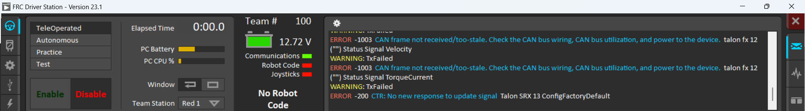
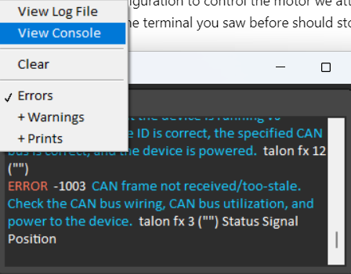
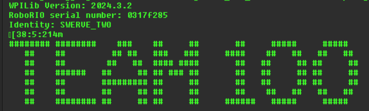

## Get the Identity of your RoboRIO
Each RoboRIO has a serial number (ID) that is used in our code to map that robot to it's "hardware configuration" (i.e. what motors etc it should expect to have). We need to find the ID of the RoboRIO you are using and set up a custom hardware configuration to control the motor we attached. If we get this right, all the errors in the terminal you saw before should stop appearing.

1. Start up the FRC Driver Station application from the Windows menu.
    1. 
    1. TODO: how do you get this installed? Does it just come with the WPI install?
    1. Your "Robot Code" light will likely be red -- we are going to turn this green!
1. Click on the "Gear" icon on the right of the `Team 100` text and select `View Console`.
    1. 
1. Look for the big `TEAM 100` logo. Right above it there should be the RoboRio serial number.
    1. 


You now have the serial number and the *current* Identity this robot thinks it is (`SWERVE_TWO` in our example). Let's go change it! 

## Create a new "Robot Identity"
In this step we are going to create a new robot Identity so that we can map custom hardware to it.

1. Open up `Identity.java` and find your robot's serial number, if it is there.
1. If it has an existing Identity + serial number, just remove thes serial number. Then, add your new identity using that serial number, like this:
```java
    SWERVE_TWO(""),
    FIRST_MOTOR_CONTROL("0317f285"),
```
1. Deploy your code again, and look for the identity above the Team Logo like you did before. It should have changed!
