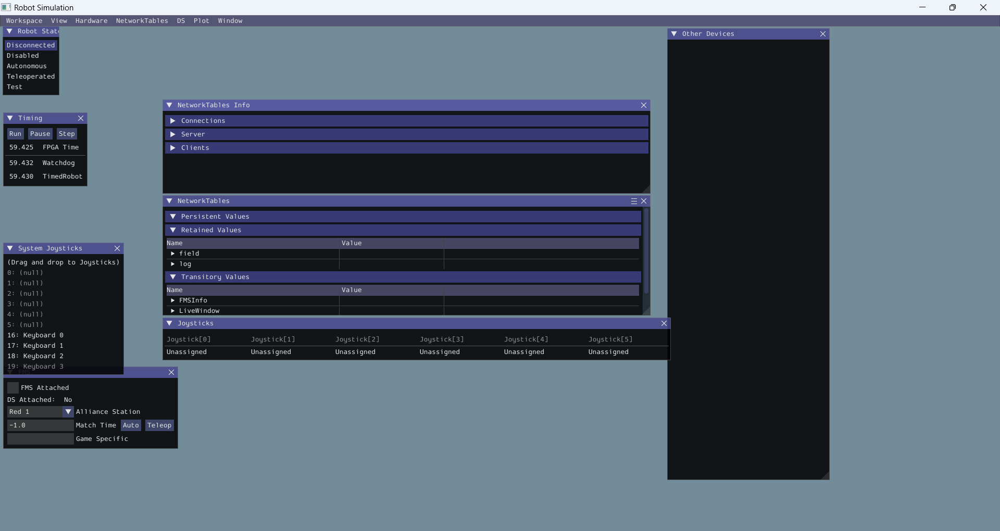
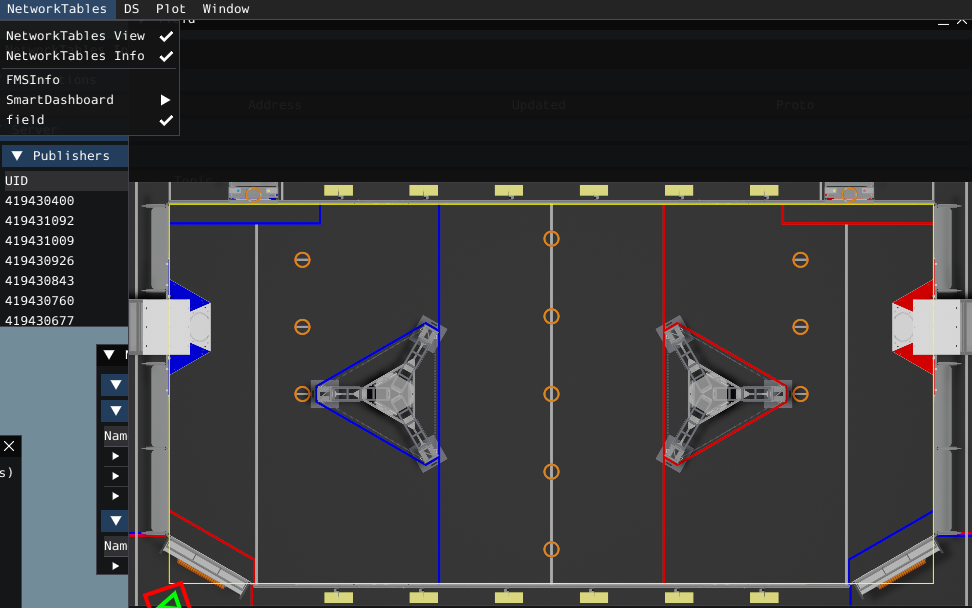
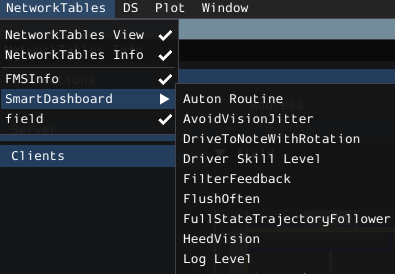
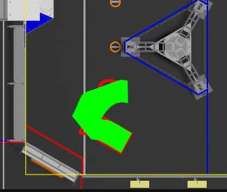

# Swerve 100

This is the main comp bot repo.

Part of the code here was (somewhat distantly) derived from 254 code, and other parts were inspired by Roadrunner.

# Getting Started

## Preparing Your Dev Env
TODO.

The rest of the instructions assume that you have the following setup:
1. Git `Team100/all24` repo checked out.
1. Custom WPI VSCode with extensions installed.
1. `swerve100` workspace opened.

## Building the RoboRIO Code
Use the WPI extensions to run the `gradlew` build:
1. Press `CTRL + SHIFT + P` to get the VSCode Command Mode.
1. Search for `Build Robot Code`
1. Select `swerve100` when it asks.
1. A terminal should pop up that runs the build. If successful, you will see this:
    ```
    BUILD SUCCESSFUL in 2s``
    6 actionable tasks: 1 executed, 5 up-to-date
    Watched directory hierarchies: [C:\Users\Engineering Student\src\all24\comp\swerve100]
    ```
TODO: what if the build is not successful?

## Simulating the RoboRIO
Use the WPI extensions to kick off the Simulator. Good overall instructions are available [here](https://docs.wpilib.org/en/stable/docs/software/wpilib-tools/robot-simulation/simulation-gui.html). 
1. Press `CTRL + SHIFT + P` to get the VSCode Command Mode.
1. Search for `Simulate Robot Code`
1. Select `swerve100` when it asks.
1. It will ask you what simulations to run. Make sure `Sim GUI` is selected, and nothing else.
1. You should get the robot simulation GUI, which looks like this:

1. Make sure you can debug your code in simulation.
    1. If you aren't familiar with debugging in VSCode, read this: TODO.
    1. Set a debug breakpoint on:
        ```java
        public void robotPeriodic() 
        ```
    1. The simulation should trip your debugger since it calls this function every few ms. Then you are ready to go!

### Using the Simulator
1. Make sure you have the Field view available. This will allow you to "drive" the robot virtually. If you don't, go to `Network Tables > Field` .
    1. If you don't see the Field view widget/option, make sure your Robot code is running flawlessly (and no breakpoints were hit).
    1. Learn more about using the Field widget [here](https://docs.wpilib.org/en/stable/docs/software/dashboards/glass/field2d-widget.html).
1. Try to drive the Robot. You will need to setup your Keyboard as a Joystick if you haven't yet. 
    1. Click and drag Keyboard 0 to Joystick[0] like this: 
    .
    1. Select `Teleoperated` from the `Robot State` widget.
    1. You should be able to use the `A-W-S-D` keys to move in 2 dimensions (Axis 0 and Axis 1).
    1. You should be able to use the `E-R` keys to rotate the robot (Axis 2).
1. Try to put the Robot in autonomous mode. This will cause it to execute known trajectories.
    1. First, let's get debugging working by increasing the Log Level. 
        1. Go to `Network Tables > SmartDashboard > Log Level`.
        
        1. Select `TRACE` level, which should be the maximum
    1. Click on `Autonomous` in the `Robot State` widget.
    1. The robot should start driving around, with these ugly trajectories drawn:
    
    1. Click the Hamburger Menu in the top-right of the field window, select Trajectory, and turn off the Arrows. You should get a nicer one like this:
    

## Making Changes
TODO show example changes to control, trajectories, etc.

## Deploying to the RoboRIO
TODO