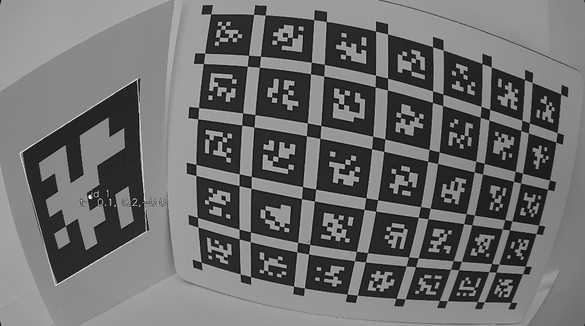
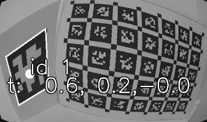

# Distortion

The tag detector looks for high-contrast quadrilaterals as candidate tags, looking for the solid black frame around the tag.

Our detection pipeline does not undistort the image prior to detection, because undistorting all the pixels is slow.  Instead, we undistort the corner points of the detected tag.

But because the detector looks for *straight* lines, this approach limits the distortion that we can handle.

The highest level of allowed distortion looks something like this, using the full resolution of the source image:

At a real-time-practical resolution (1/4 scale), it might look like this:

Note how the drawn tag box misses the actual corner of the tag.  The line is chosen as a best-fit to the whole edge, which means that distortion will create this kind of corner error.  It's not just a one-pixel error.  I tried experimenting with config settings (e.g. maximum fit MSE) to make the detector more forgiving, but I couldn't make that work.

For our tag size, this error is about 5 mm in real-world terms.

For comparison, here's the original:

The distorted images are obviously very distorted -- more distorted than our the images our GS+6mm camera setup produces, so maybe this isn't an issue.  But if the detector seems to fail for close-up tags, maybe this is the reason.

We might also want to repeat these examples using real GS+6mm images, to estimate the pixel error of the camera -- I'm guessing it would be something like 1 or 2 pixels.

For more about the detection algorithm, see 

* the [original AprilTag paper](https://april.eecs.umich.edu/media/pdfs/olson2011tags.pdf)
* the [AprilTag 2 paper](https://april.eecs.umich.edu/media/pdfs/wang2016iros.pdf)
* the [AprilTag 3 paper](https://april.eecs.umich.edu/media/pdfs/krogius2019iros.pdf)