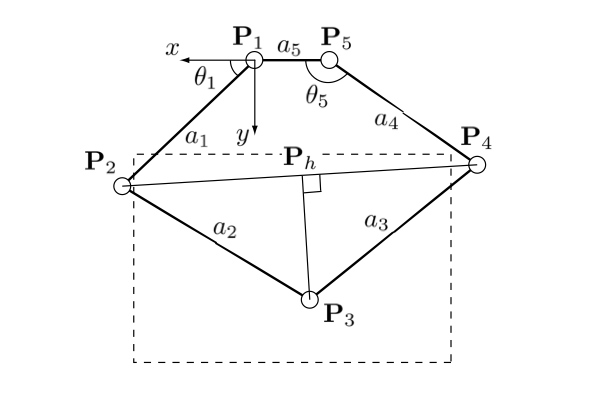
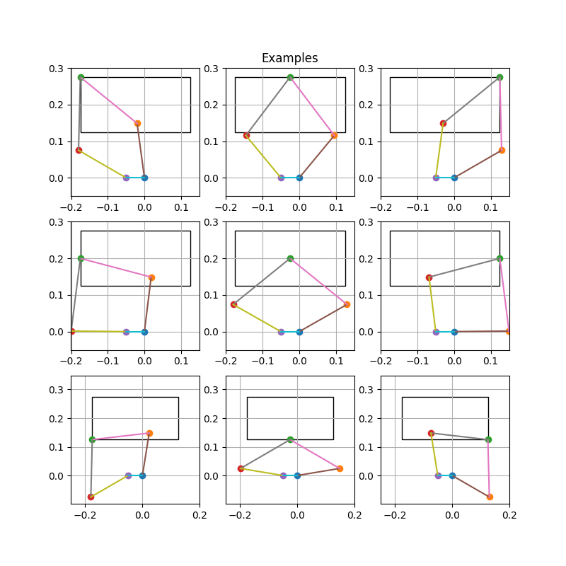
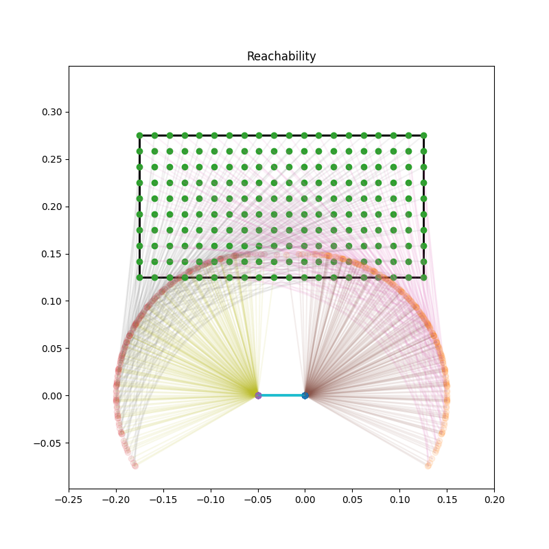
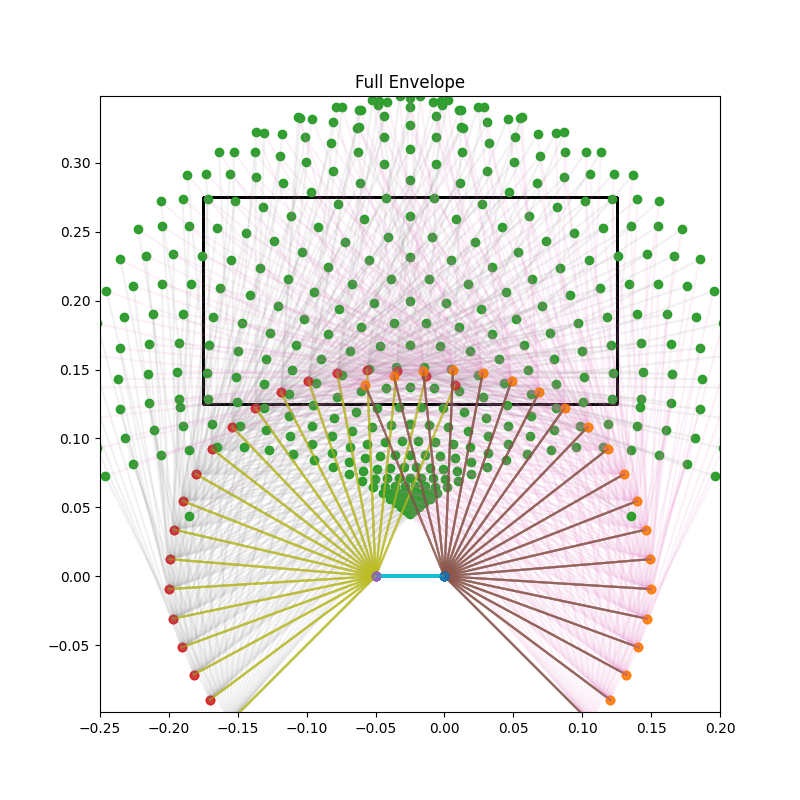
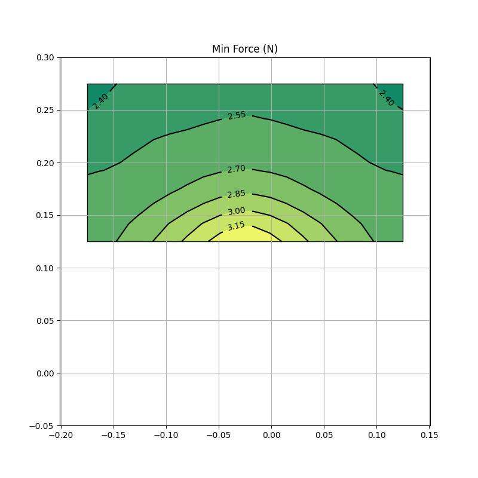
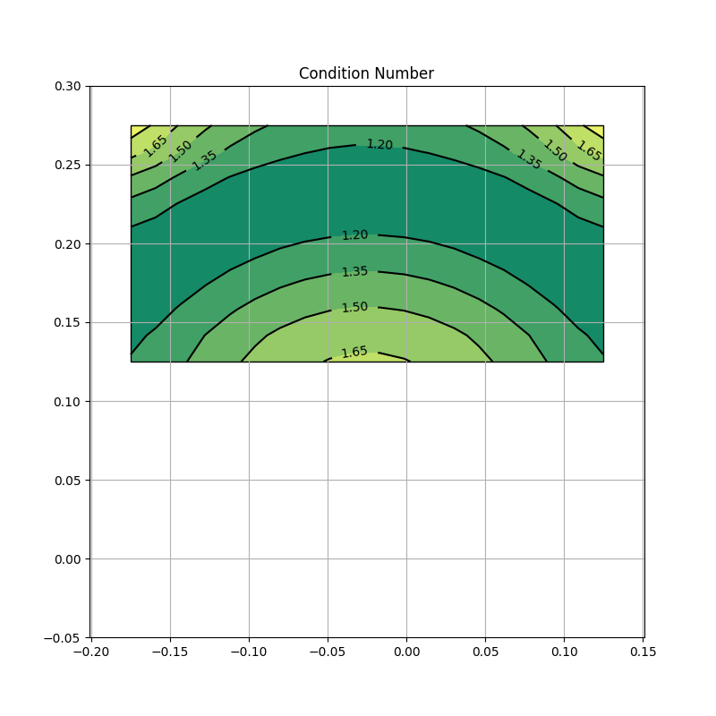

# Five Bar

A two-dimensional parallel manipulator linkage, similar to a parallel SCARA machine.

The analysis uses these coordinates; a5 is the grounded link.  Note the images below are inverted compared to this diagram.

These are examples of where the mechanism can reach in the work envelope.

This shows that the entire envelope can be reached.

This is the full envelope of the machine; notice the poor resolution near the edges.

This is the minimum force corresponding to stall torque.

This is the condition number of the Jacobian, indicating that the mechanism is well behaved.

This repo is a copy of truher/fivebar, it's ok to let it diverge.